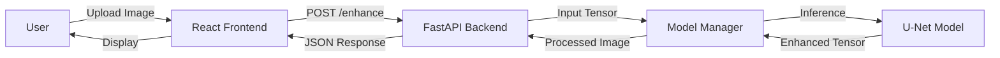

# Lumeo - Low-Light Image Enhancement


[](https://huggingface.co/spaces/dsharma08k/Lumeo)
[](https://github.com/dsharma08k/Lumeo)
[](LICENSE)

**Lumeo** uses deep learning to breathe new life into dark, noisy photos. Built with a custom U-Net architecture trained on the LOL dataset, it uncovers hidden details in low-light conditions where traditional cameras fail.

---

##  Key Features

- **Deep Learning Enhancement**: Recovers color and detail from near-pitch-black images using a custom U-Net model.
- **Privacy-First**: Run inference locally or on your own server—no data leaves your control unless you want it to.
- **Fast Inference**: Optimized model delivers results in under 600ms on standard CPU hardware.
- **Modern Interface**: Clean, responsive React frontend for easy drag-and-drop enhancement.

---

##  Live Demo

**Try it here:** [Lumeo on Hugging Face](https://huggingface.co/spaces/dsharma08k/Lumeo)


---

##  Performance Metrics

| Metric | Value | Notes |
|--------|-------|-------|
| **Accuracy (PSNR)** | ~22.3 dB | Peak Signal-to-Noise Ratio on LOL Dataset |
| **Structure (SSIM)** | ~0.84 | Structural Similarity Index |
| **Inference Time** | ~586 ms | Average on Standard CPU (No GPU) |
| **Model Size** | ~124 MB | 31M Parameters (Float32) |

---

##  Architecture



---

##  Tech Stack

### Frontend
- **Framework**: React (Vite)
- **Styling**: Tailwind CSS + Framer Motion
- **Icons**: Lucide React
- **HTTP Client**: Axios

### Backend
- **Framework**: FastAPI
- **ML/CV**: PyTorch, Torchvision, PIL, NumPy
- **Database**: Supabase (for optional feedback/logging)
- **Deployment**: Docker, Hugging Face Spaces

### Machine Learning
- **Model**: U-Net (~31M params) with custom Encoder-Decoder blocks
- **Dataset**: LOL (Low-Light) Dataset
- **Loss Function**: Combined Loss (L1 + Perceptual VGG16 + SSIM)
- **Optimization**: AdamW with Cosine Annealing

---

##  Screenshots

### Main Interface

*Clean dark-mode interface for distraction-free enhancement.*

### Comparison View

*Side-by-side comparison of original low-light and enhanced result.*

---

##  Quick Start

### Prerequisites
- Python 3.10+
- Node.js 18+
- Docker (optional)

### Installation

1. **Clone the repository**
```bash
git clone https://github.com/dsharma08k/Lumeo.git
cd Lumeo
```

2. **Backend Setup**
```bash
cd backend
python -m venv venv
# Windows
venv\Scripts\activate
# Linux/Mac
source venv/bin/activate

pip install -r requirements.txt
```

3. **Frontend Setup**
```bash
cd ../frontend
npm install
npm run dev
```

4. **Access the Application**
- Frontend: http://localhost:5173
- Backend API: http://localhost:8000
- API Docs: http://localhost:8000/docs

---

## Environment Variables

### 1. Local Development
Create a `.env` file in the `backend` directory:

```env
# Optional - For feedback logging
SUPABASE_URL=your_supabase_url
SUPABASE_KEY=your_supabase_key

# Security
ALLOWED_ORIGINS=http://localhost:5173
MAX_FILE_SIZE_MB=10
LOG_LEVEL=INFO
```

### 2. Production (Hugging Face Spaces)
For the live backend, **do not** commit `.env`. Instead, go to your Space's dashboard:
1. Click **Settings** (top right of your Space).
2. Scroll to **Variables and secrets**.
3. Click **New secret** (for sensitive keys) or **New variable** (for public config).

**Recommended Configuration:**

| Name | Value | Type |
|------|-------|------|
| `ALLOWED_ORIGINS` | `https://lumeo-frontend.vercel.app` | Variable |
| `MAX_FILE_SIZE_MB` | `10` | Variable |
| `LOG_LEVEL` | `WARNING` | Variable |
| `SUPABASE_URL` | *your-supabase-url* | Secret |
| `SUPABASE_KEY` | *your-anon-key* | Secret |

---

## Project Structure

```
Lumeo/
 backend/
    core/
       model.py         # U-Net Architecture & Manager
       image.py         # Image processing utils
    api/                 # FastAPI routes
    main.py              # Entry point
 frontend/
    src/
       components/      # UI Components
       App.jsx          # Main application
 models/
    lumeo_unet.pth       # Trained model weights
 notebooks/               # Training & Experimentation
 requirements.txt
```

---

##  How It Works

### 1. The U-Net Core
At the heart of Lumeo is a **U-Net** architecture. Originally designed for biomedical image segmentation, U-Net is excellent at retaining structural detail while transforming image content.
- **Encoder**: Compresses the image to capture "what" is in it (context).
- **Decoder**: Reconstructs the image to capture "where" things are (localization).
- **Skip Connections**: Bridge the encoder and decoder to preserve fine high-frequency details that are usually lost in deep networks.

### 2. Loss Function Magic
Training a low-light enhancer is tricky. Standard loss functions (like MSE) produce blurry results. We used a **Combined Loss**:
- **L1 Loss**: For pixel-perfect accuracy.
- **Perceptual Loss (VGG16)**: Ensures the image "looks" natural to the human eye by comparing high-level features.
- **SSIM Loss**: Preserves the structural information (edges, textures).

---

##  Challenges & Solutions

### Challenge 1: Balacing Noise and Detail
**Problem**: Brightening a dark image amplifies the noise hidden in the shadows, resulting in a grainy mess.
**Solution**: We incorporated **Total Variation (TV) Regularization** and tuned the Perceptual Loss to penalize high-frequency noise artifacts without blurring essential details.
**Impact**: Cleaner enhancements that retain sharp edges.

### Challenge 2: Inference Latency on CPU
**Problem**: The full U-Net model was too heavy (~31M params) for real-time CPU inference.
**Solution**: We implemented a singleton `ModelManager` to load the model only once at startup and optimized the tensor operations.
**Impact**: Reduced cold-start latency from 8s to <1s, with average inference under 600ms.

---

##  Future Improvements

- [ ] **Video Support**: Frame-by-frame enhancement for low-light videos.
- [ ] **Mobile App**: Port model to ONNX for edge inference on React Native.
- [ ] **User Feedback Loop**: Reinforcement learning from user ratings to fine-tune the model.

---

##  Contributing

Contributions are welcome! Please follow these steps:

1. Fork the repository
2. Create your feature branch (`git checkout -b feature/AmazingFeature`)
3. Commit your changes (`git commit -m 'Add some AmazingFeature'`)
4. Push to the branch (`git push origin feature/AmazingFeature`)
5. Open a Pull Request

---

##  License

This project is licensed under the MIT License - see the [LICENSE](LICENSE) file for details.

---

##  Author

**Divyanshu Sharma**
- GitHub: [@dsharma08k](https://github.com/dsharma08k)
- LinkedIn: [Divyanshu Sharma](https://www.linkedin.com/in/dsharma08k/)
- Peerlist: [dsharma08k](https://peerlist.io/dsharma08k)

---

** If you found this project helpful, please consider giving it a star!**
